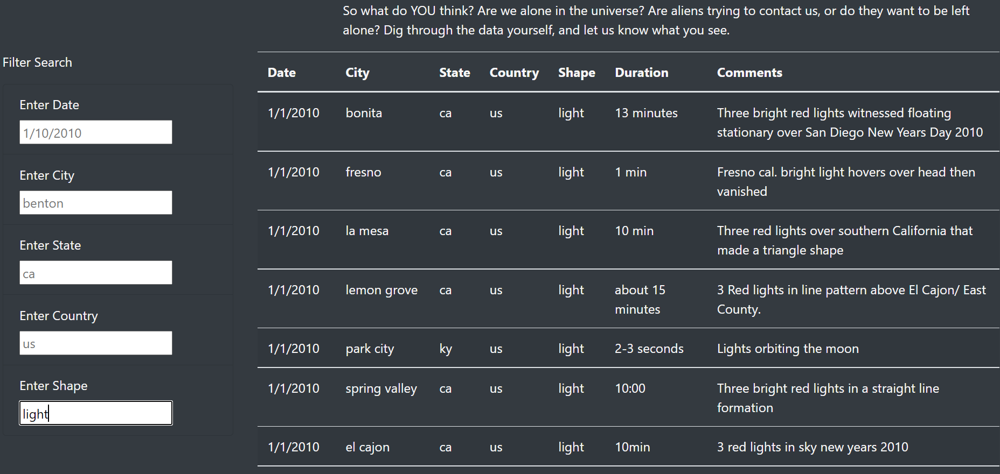

# UFOs

## Overview

  The purpose of this project was to create a create a webpage with the ability to filter through a table of data and display a new data based on the filtered criteria.
  
## Results

  The resulting website starts with a full table of data that can be filtered by entering a date, city, state, country, and or shape.  The user can enter one, mutiple or all search criteria for specified results.  There are pre-set examples in each box that signify to the user as to how they should format the search criteria, such as date in a format of "1/1/2010" or state as "ca". After typing information into the search categories, the user must press enter to filter the results, and will get an updated webpage, like the following, obtained by filtering the shape category with "light".
  

  To reset the webpage back to a full set of information, the user can select "UFO Sightings" at the very top of the page. If the user enters search criteria that doen't match any of the data, the page will display a blank table.
  
## Summary

  - One Drawback

  A drawback to the webpage is that there is not a "find" button to be entered when the user has entered their search criteria or instructions on pressing "Enter". If the user doesn't assume that they should press enter, they may question how to filter the data.
  
  - Two Recommendations 

  The first recommendation to improve the user experince of the webpage would be to either add instructions to press "Enter" after entering the search criteria or to add a "Find All" button at the bottom of the "Filter Search" box.  A second recommendation would be to make the "UFO Sightings" appear more as a "Homepage" button so that the user knows to click that in order to reset the webpage. 
